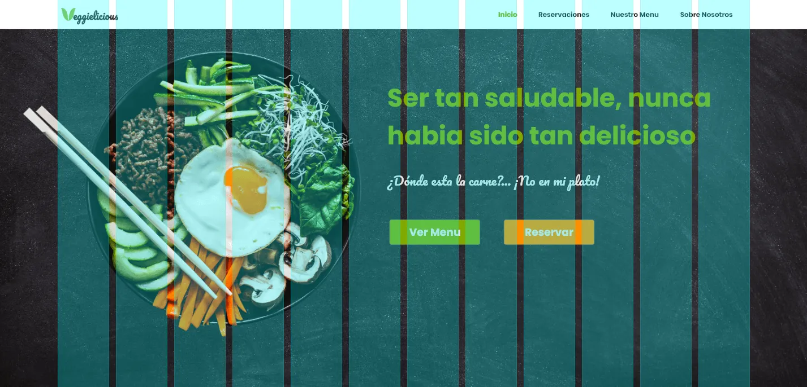
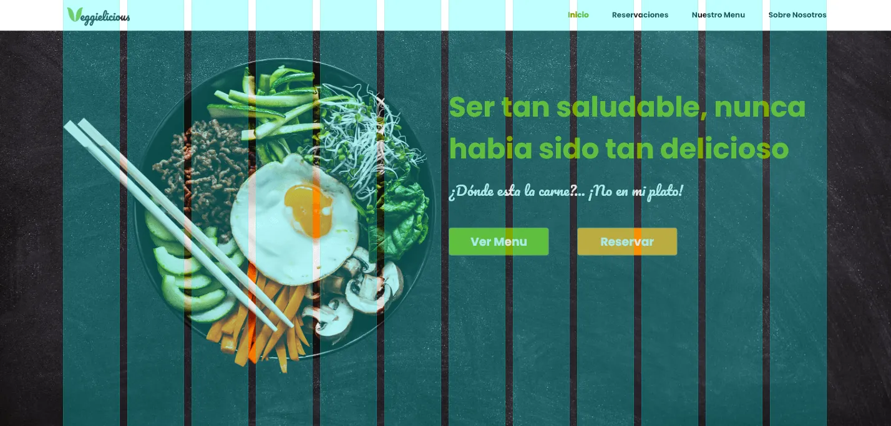

# Alineación

La alineación es una técnica de diseño que se utiliza para organizar los elementos de una página web de manera que se vean ordenados y limpios. La alineación puede ser horizontal o vertical y se puede aplicar a cualquier elemento de la página, como texto, imágenes, botones, etc.

## Tipos de alineación

- Horizontal
    - Izquierda
    - Derecha
    - Centro
- Vertical
    - Superior
    - Inferior
    - Centro

## Cuadrícula

La cuadrícula es una técnica de diseño que se utiliza para organizar los elementos de una página web en filas y columnas. La cuadrícula es una forma eficaz de alinear los elementos de una página web y de crear un diseño ordenado y limpio.

1. Sin cuadrícula

2. Con cuadrícula

3. Alineación a cuadrícula

## Alineación al centro

La alineación al centro es una técnica de diseño que se utiliza para centrar los elementos de una página web en el centro de la pantalla. La alineación al centro es una forma eficaz de crear un diseño ordenado y limpio.

>Experimentar con otros tipos de alineación para crear algo con más personalidad

## Justificado

El justificado es una técnica de diseño que se utiliza para alinear el texto de una página web de manera que se vea ordenado y limpio. El justificado es una forma eficaz de crear un diseño profesional y atractivo.

>Evitar texto justificado, no luce bien

## Conclusión

- Mantener una conexión entre los elementos dibujando líneas o usando una cuadrícula.
- SIempre buscar una forma de alinearlos y crear conexión entre sí.
- La alineación busca organizar y unificar los elementos para que exista orden donde podría haber caos.

## Referencias

- [https://webdesignis.fun/como-alinear-tus-elementos-correctamente/?utm_source=udemy&utm_medium=leccion&utm_campaign=curso](https://webdesignis.fun/como-alinear-tus-elementos-correctamente/?utm_source=udemy&utm_medium=leccion&utm_campaign=curso)

