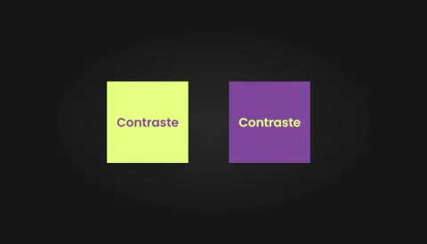
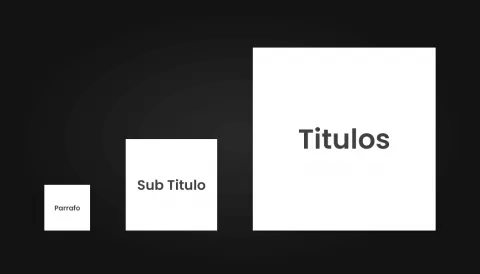
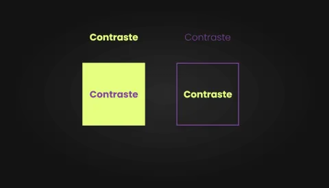

# Contraste

El contraste es uno de los principios básicos del diseño gráfico y la tipografía. Se refiere a la diferencia entre dos elementos, como el texto y el fondo. Un buen contraste es esencial para garantizar que el texto sea legible y fácil de leer.

El principio del contaste indica que, si ciertos elementos no son los mismos, entonces debe de hacerlos lucir realmente diferentes con el fin de resaltar los elementos más importantes.

## 3 formas de crear contraste

**Color**: Utilizar colores contrastantes para resaltar elementos importantes. 

:::tip
Utilizar colores complementarios
:::

**Tamaño**: Utilizar diferentes tamaños de fuente para resaltar elementos importantes. Tambien se puede aplicar a formas y líneas.

**Peso**: Utilizar diferentes pesos de fuente para resaltar elementos importantes. Tambien se puede aplicar a formas y líneas.

:::tip
Utilizar con fuentes tipográficas o formas
:::

Ejemplo con formas:

## Conclusión

El contraste permite captar la atención de los usuarios.

Se puede generar contraste combinando fuentes tipográficas, colores, formas, líneas, etc.

Ejemplo que aplica las 3 formas principales de crear contraste:

## Referencias

- [https://webdesignis.fun/como-crear-contraste-en-tus-disenos/?utm_source=udemy&utm_medium=leccion&utm_campaign=curso](https://webdesignis.fun/como-crear-contraste-en-tus-disenos/?utm_source=udemy&utm_medium=leccion&utm_campaign=curso)

