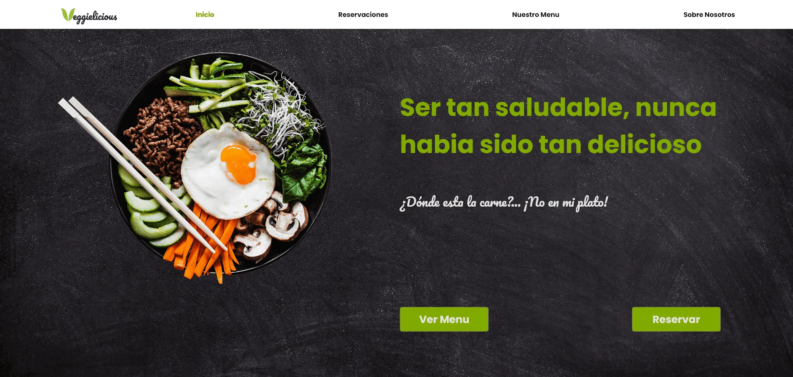

# Proximidad

En diseño gráfico, la proximidad es una técnica que se utiliza para organizar los elementos de una página web de manera que se vean ordenados y limpios. La proximidad es una forma eficaz de crear un diseño coherente y atractivo.

La proximidad es uno de los 4 principios básicos del diseño.

:::tip
**Como recla de oro**, las cosas que están relacionadas deben estar juntas y las cosas que no están relacionadas deben estar separadas.
:::

## Diseño web

Sin proximidad

Con proximidad

## Conclusión

Al agrupar elementos colocandolos cerca unos de otros, se convierten en una unidad visual que permite transmitir información de forma fácil.

:::info
- **COMUNICAR**
- **ORGANIZAR**. Usar una cuadrícula
:::

:::tip
**Ejercicios para cada uno de tus diseños:**
- ¿Se sienten mis ojos cómodos siguiendo la información?
- ¿Qué tanto hace el diseño que mis ojos se detengan?
- ¿Es fácil encontrar la información?
:::

:::warning
- **No** agrupar elementos que no están relacionados.
- **Evitar** tener muchos elementos separados.
- **No** crear elementos en las esquinas con el fin de evitar espacios en blanco.
:::

## Referencias

- [https://webdesignis.fun/la-proximidad-en-el-diseno/?utm_source=udemy&utm_medium=leccion&utm_campaign=curso](https://webdesignis.fun/la-proximidad-en-el-diseno/?utm_source=udemy&utm_medium=leccion&utm_campaign=curso)
