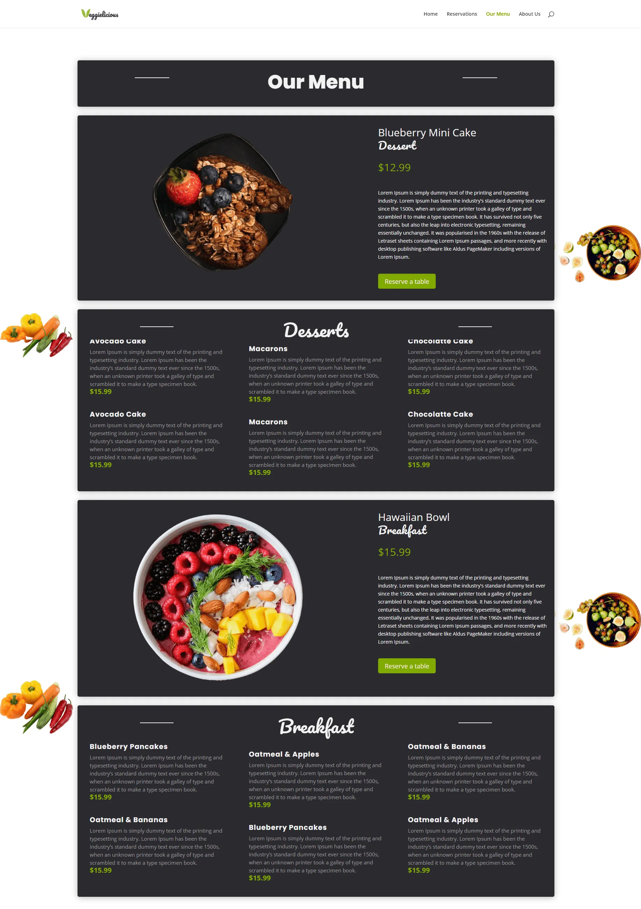

# Repetición

La repetición es uno de los 4 principios básicos del diseño.

La repetición trata de repetir algún estilo o aspecto a lo largo de toda tu pieza de diseño. Ayuda a crear consistencia.

Se pueden repetir: formatos de diseños, grosor de líneas, formas, texturas, imágenes, videos, colores, etc.

:::tip
Importante aplicar la repetición cuando la web tenga varias páginas para que los usuarios se sientan en el mismo lugar.
:::

Ejemplo en diseño web:

## Referencias

- [https://webdesignis.fun/que-es-la-repeticion/?utm_source=udemy&utm_medium=leccion&utm_campaign=curso](https://webdesignis.fun/que-es-la-repeticion/?utm_source=udemy&utm_medium=leccion&utm_campaign=curso)

