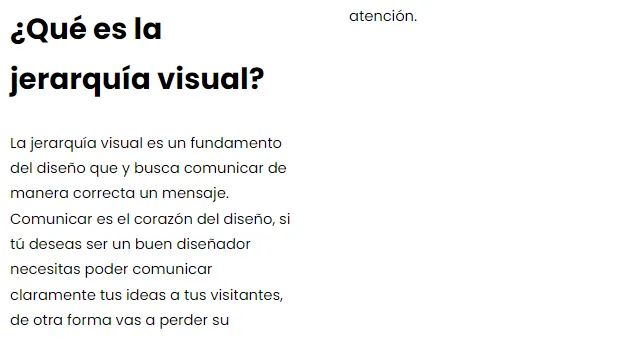
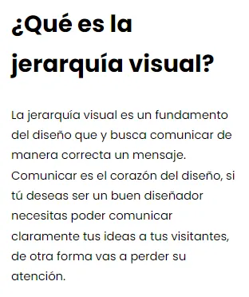
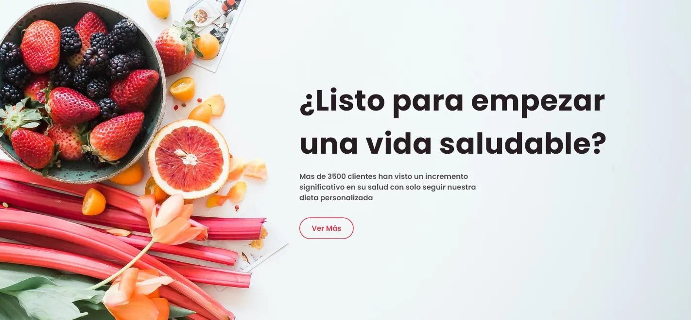
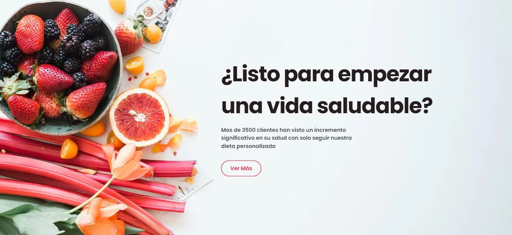
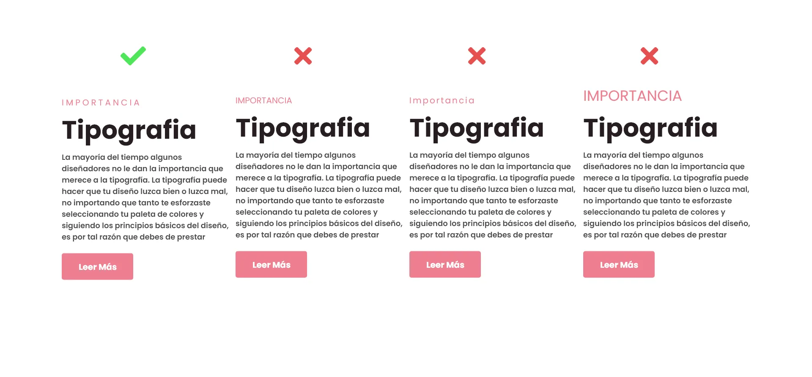
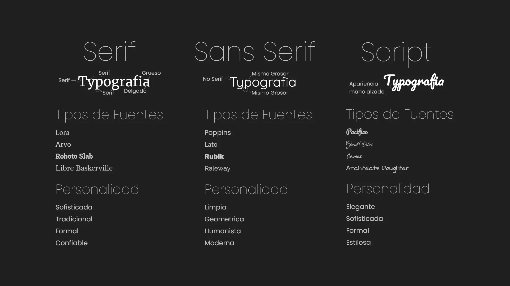
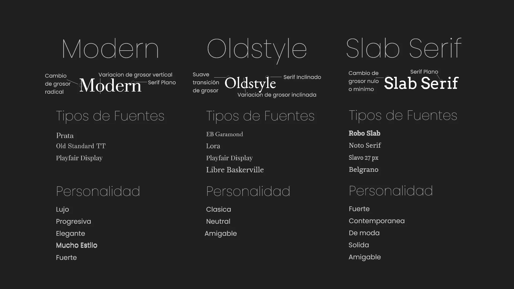
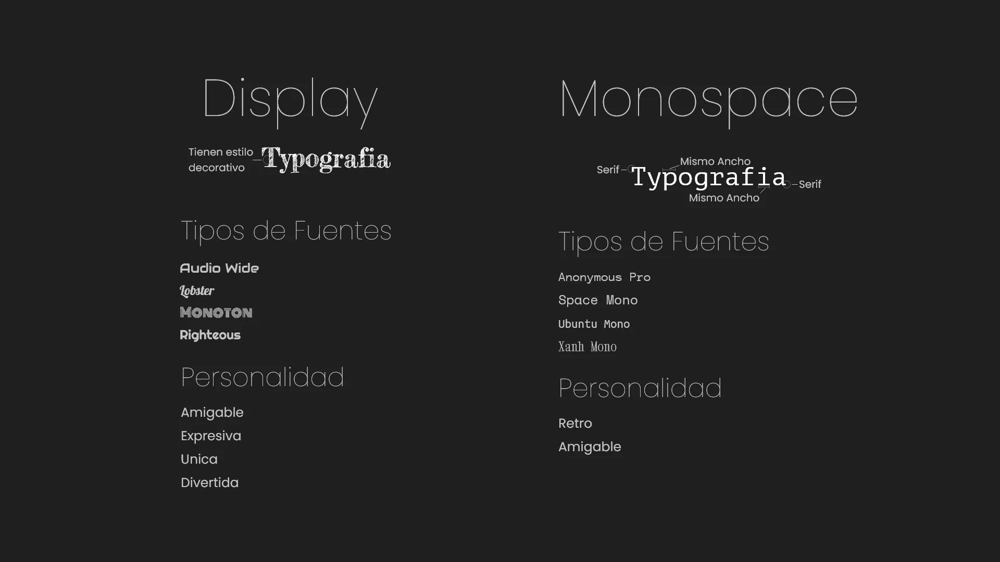

# Tipografía

## Combinación de tipografías

- [Canva - Guia definitiva para combinar fuentes](https://www.canva.com/es_mx/aprende/guia-definitiva-para-combinar-fuentes/)

## ¿Que es la tipografía?

Es el arte y técnica de disponer correctamente el texto en una página, tanto impresa como digital.

:::warning
No utilizar más de 2 tipos de fuentes.
:::

## Subrayado

NO se recomienda el uso de subrayado en textos digitales, ya que se puede confundir con un hipervínculo.

## Huérfanos y viudas en tipografía

Evitar que queden huérfanos y viudas en los textos.

- **Huérfanos**: Es la última línea de un párrafo que queda sola al principio de una columna o página.

- **Viudas**: Es la primera línea de un párrafo que queda sola al final de una columna o página.

## Doble Espacio

No se recomienda el uso de doble espacio después de un punto.

## Interletrado y seguimiento

- **Interletrado**: Espacio entre letras.
- **Seguimiento**: Espacio entre palabras.

Consejos:

- **Interletrado**: 1% a 2% del tamaño de la fuente. 
- **Seguimiento**: 120% a 150% del tamaño de la fuente.
- **Interlineado**: 120% a 150% del tamaño de la fuente.

:::tip
Incrementar cuando la fuente es más delgada y más pequeña, reducir cuando la letra se haga más gruesa y grande.
:::

Ejemplo:

Sin aplicar Interletrado a título

Interletrado aplicado a título

## MAYÚSCULAS

Con las MAYÚSCULAS podemos generar contraste y jerarquía en el texto.

- **Evitar**: No escribir todo en mayúsculas.
- **Usar**: Para títulos y subtítulos.
- **Combinar**: Con minúsculas para mejorar la legibilidad.

## Categorias de tipografías

- **Serif**: Con remates.
- **Sans Serif**: Sin remates.
- **Script**: Manuscritas.

Subcategorías de Serif:

Estas no se suelen utilizar en diseño web.

- **Display**: Para títulos.
- **Monospace**: Para código.

## Combinar fuentes

- **Relación en conflicto**: Fuentes que compiten entre sí. Se consigue utilizando dos tipos de fuentes pertenecientes a la categoría Sans Serif, o dos Serif y así sucesivamente.
- **Relación de acuerdo o amistad**: Misma fuente. Se consigue utilizando un único tipo de fuente para todo el diseño. Diseño tranquilo y formal, relación conservadora.
- **Relación de contraste**: Fuentes que se complementan. Se consigue utilizando una fuente Serif y una Sans Serif, o una Serif con Script. Diseño más dinámico y moderno.

## Referencias

- [https://webdesignis.fun/que-es-la-tipografia/?utm_source=udemy&utm_medium=leccion&utm_campaign=curso](https://webdesignis.fun/que-es-la-tipografia/?utm_source=udemy&utm_medium=leccion&utm_campaign=curso)
