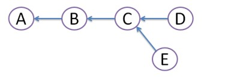
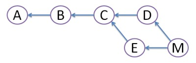
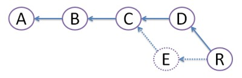

## Diferencia

> **Cuando haces git rebase:**

- los commits locales se eliminan de la rama temporalmente.
- se ejecuta un git pull.
- los commits locales se insertan nuevamente.

Esto quiere decir que todos tus commits locales aparecen al final, después de los commits remotos. Esto es, si haces git log, los commits de la rama que has rebasado aparecen como si fueran más antiguos, independientemente de cuándo se hicieran.

> **Cuando haces git merge**

- Une dos o más historiales de desarrollo, es decir, cuando haces un merge de una rama en la tuya juntas el historial de ámbas.

Después de hacer esto una y otra vez tendras un historial intercalado entre los cambios realizados por varias personas.

## Explicación paso a paso

1. Supongamos que tienes 3 commits A, B, C:

   

2. Entonces viene Daniel y crea un commit D. Luego Enrique crea un commit E

   

3. Obviamente, este conflicto debe ser resuelto de alguna forma. Para ello hay dos maneras

   - **MERGE**
     Ambos commits D y E aún están allí, pero creamos un commit de unión (merge commit) M que hereda los cambios de ambos commits D y E. Sin embargo, esto crea la estructura en forma de diamante, que a mucha gente confunde.

     

   - **REBASE**
     Creamos un commit R, cuyo contenido es idéntico al del commit M descrito arriba. Sin embargo, nos cargamos el commit E como si nunca hubiera existido (se ve con los puntitos, en la línea evanescente). De acuerdo con esta anulación, E debería ser un commit local de Enrique y no debería haber hecho push a ningún repositorio. La ventaja de este método es que se evita la forma de diamante y el historial permanece lineal, que es algo que la mayoría de los desarrolladores agradecen

     

## En conclusión

Con git rebase tendrás un historial más claro, por lo que suele ser la opción preferida.
