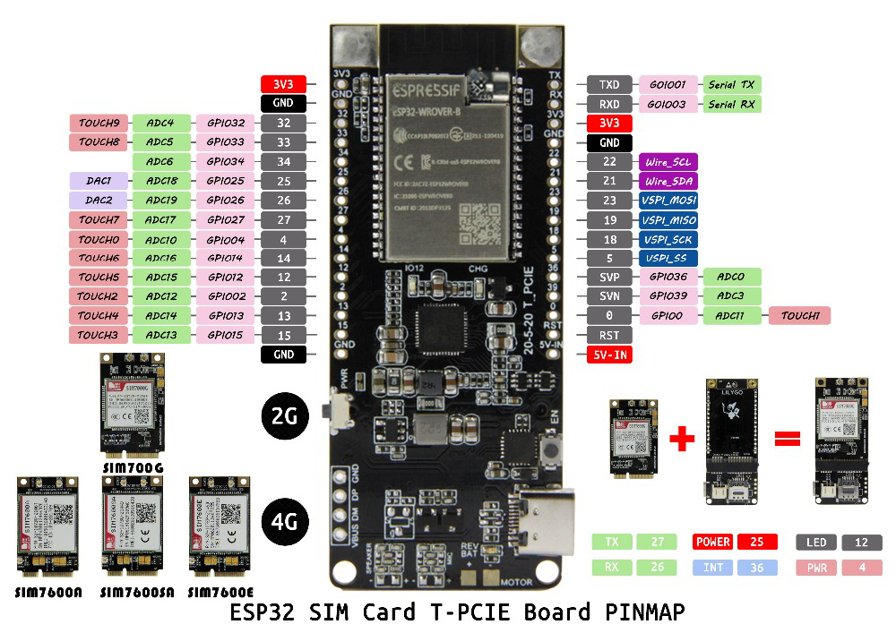

- **Las especificaciones de Hardware**

  - Chipset: ESP32-WROVER-B, AXP192 chip de gestión de energía
  - Flash: 4MB
  - Estática SRAM: 8MB
  - SRAM: SRAM de 520 kB
  - Botón: interruptor de encendido PWR, reinicio
  - USB a TTL: CP2104
  - Reloj de coche: oscilador de cristal de 40MHz
  - Equipo periférico: ranura para tarjeta SIM Nano, ranura para tarjeta Mini PCIE
  - Antena: antena integrada (por defecto)
  - Voltaje de funcionamiento: 2,7 V a 3,6 V
  - Corriente de trabajo
  - Corriente de sueño: aprox. 700ma
  - ¿Rango de temperatura de funcionamiento: -40 °C? + 85 ℃
  - Tamaño: 75*33*10,5mm
  - Peso: 14,5g

- **Especificaciones de alimentación**

  - Entrada de energía: USB 5V / 1A
  - Corriente de carga: 500 mA
  - Entrada de batería: 3,7-4,2 V
  - IC de carga: AXP192
  - Conector JST: 2 pines 2,0mm
  - USB: Tipo C

- **Inalámbrico en línea**

  - Estándar: FCC / CE-RED / IC / TELEC / KCC / SRRC / NCC (ESP32 chip)
  - Protocolo: 802,11 b / g / n (802.11n, velocidad de hasta 150Mbps) A-MPDU y agregación de A-MSDU, soporta Intervalo de protección de 0,4 μs
  - Rango de frecuencia: 2,4 GHz/2,5 GHz (2400M 2483,5 M)
  - Potencia de transmisión: 22dBm
  - Distancia de comunicación: 300m

- **Bluetooth**
  - Protocolo: se ajusta a los estándares Bluetooth v4.2BR/EDR y BLE
  - Radio Frecuencia: sensibilidad-97dBm NZIF receptor clase 1, Clase 2 y Clase 3 Transmisor AFH
  - Audio: CVSD y SBC de audio
  - Software especificaciones
  - Modo Wi-Fi: Estación de trabajo/SoftAP + estación/P2P
  - Mecanismo de seguridad: WPA / WPA2/ WPA2-Enterprise/ WPS
  - Método de cifrado: AES / RSA / ECC / SHA
  - Actualización del Firmware: UART descargar/OTA (descargar y escribir el firmware a través de la red/host)
  - Desarrollo de Software: compatible con desarrollo de servidor en la nube/SDK para el desarrollo de firmware del usuario
  - Protocolo de red: IPv4... IPv6 SSL TCP/UDP/HTTP/FTP/MQTT
  - Configuración del usuario: AT + set de instrucciones, servidor en la nube, Android / iOSapp
  - Sistema operativo: freeros
