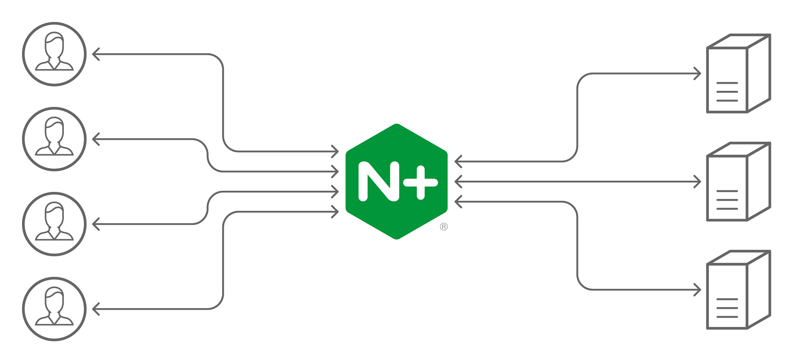

**Documentación oficial:** [http://nginx.org/en/docs/](http://nginx.org/en/docs/)

Software libre y de código abierto, licenciado bajo licencia BSD. También existe una versión comercial, Nginx Plus.
Es un servidor web o servidor proxy inverso ligero de alto rendimiento que también permite protocolos de correo electrónico IMAP/POP3.

## Características

- Servidor de archivos estáticos, índices y autoindexado
- Proxy inverso con opciones de caché
- Balanceo de carga
- Tolerancia a fallos
- Soporte HTTP y HTTP2 sobre SSL
- Soporte para FastCGI con opciones de caché
- Servidores virtuales basados en nombre o dirección IP
- Soporte para autenticación
- Compartible con IPv6
- Compresión gzip
- Habilitado para soportar más de 10.000 conexiones simultáneas
- Permite habilitar/deshabilitar módulos



## Instalación

```sh
sudo apt install nginx
# Mostrar la versión
apt-cache show nginx
nginx -v
```

### Instalaciones en varias distribuciones

```sh
# Debian y derivados
apt-get install nginx php7.0 php7.0-fpm
apt-get install php7.0-mysql mariadb-server mariadb-client

#Windows
Descargar los instaladores de Nginx, MariaDB y PHP
```

## Configuración

- Directorio y archivos de configuración

  ```sh
  # Directorio de configuración
  cd /etc/nginx

  # Archivo principal de configuración
  sudo vim nginx.conf
  ```

- Verificar los archivos de configuración
  `nginx -t`

## Ejecución

```sh
sudo /usr/bin/nginx
sudo service nginx start
sudo service nginx restart
sudo service nginx stop
nginx -s stop|quit|reopen|reload
```

## Directivas

### Del núcleo

```conf
user nginx <grupo>; # usuario creado en el sistema Linux para Nginx
daemon off; # correr el proceso de fondo (por defecto esta en on)
debug_points stop|abort; # punto de interrupción de depuración
env VARIABLE=valor; # asignar o modificar variables de entorno
worker_processes 1; # número de procesos de nginx (se puede ajustar al número de núcleos del procesador)
error_log /var/log/nginx/<fichero.log> debug|info|notice|warm|error|crit|alert
lock_file # crear un archivo de bloque (por cada proceso de ejecución, hasta que no termine una solicitud no podrá ejecutarse otra)
log_not_found on|off; # páginas no encontradas (errores 4xx)
master_process on; # pude ejercutar 1 o más procesos para solicitudes (por defecto esta en on)
```

### De eventos

```sh
worker_connections 1024; # número de usuarios concurrentes conectados
use epoll; # definir el modelo de eventos (epoll por defecto) NO se debe modificar
accept_mutes on|off; # permite exclusión mutua en la escucha de socket
accept_mutex_delay 500ms; # tiempo de espera de escucha en el socket
multi_accept on|off; # aceptar o no varias conexiones a la vez en cola al mismo tiempo
```

### Directivas HTTP, Server y Location

- **Sockets y Hosts**

  ```sh
  listen [ip]:[puerto]; # ip o puerto a la escucha del servidor

  listen 0.0.0.0:8080 default_server; # ip4 (server)
  listen [::]:8080; # ip6 (server)
  listen 443 ssl; (server)
  listen unix:/tmp/nginx.sock; # puerto socket unix para cada uno de las peticiones (server)

  server_name localhost www.web-php.local web-php.local; # importente el orden www... (server)

  # server_name_in_redirect on|off; (http, server, location) predeterminado: off
  # port_ip_redirect (http, server, location) predeterminado: on
  # tcp_nodelay (http, server, location) predeterminado: on
  # tcp_nopush (http, server, location) predeterminado: off
  # sendfile (http, server, location) predeterminado: off
  # reset_timedout_connection (http, server, location): off
  # sendfile_max_chunk (http, server) predterminado: 0
  # send_lowat (http, server) predterminado: 0
  # server_names_hash_max_size (http) predterminado: 512
  # server_names_hash_bucket_size (http) predterminado: 32, 64 o 128 dependiendo del cache del procesador
  ```

- **Rutas y archivos**

  ```sh
  root /var/www/html; # (http, server, location, if)
  alias mi_server; # (location)

  location /admin/ {
      root /var/www/php-web/test/;
  }

  error_page codigo sitio; (http, server, location, if)
  # error_page code1 [code2...] [=replacement code] [=@block | URI];
  # error_page 404 =200 404.html;

  if_modified_since off|exact|before; # (http, server, location) default: exact # permiso para la araña de buscadores a la fecha de modificación de la página

  index index.html index.php /archivo.html; # (http, server, location)

  recursive_error_pages ; # (http, server, location) default: off (reenvio en la página de error si da error, bucle infinito...)

  try_files (server, location)
  location /inicio/ {
      try_files admin.php @redireccion;
      #try_files $uri = 404;
  }
  location @redireccion {
      rewrite ^ index.php permanent;
  }
  ```

- **Peticiones cliente**

  ```sh
  (http, server, location)
  keepalive_request 100; # default 100 (100 por sesión)
  keepalive_timeout 500;
  keepalive_disable msie|safari|webkit|mozilla|chrome|none; # default msie
  send_timeout 60; # default 60
  client_body_in_file_only off; # default off
  client_body_in_single_buffer off; # default off
  client_body_buffer_size 8k; # default 8k (32bits) o 16k (64bits) (2 páginas de memoria)
  client_body_temp_path path [level1] [level2] [level3]; # defautl client_body_temp
  client_body_timeout 60; # default 60
  client_header_buffer_size 1k; # default 1k
  client_header_timeout 60; # default 60
  client_max_body_size 1m; # default 1m
  large_client_header_buffers 4 8k; # default 4 8k
  lingering_time 30s; # default 30s
  lingering_timeout 5s; # default 5s
  lingering_close on; # default on
  ignore_invalid_headers on; 3 default on (http, server)
  chunked_transfer_encoding on; # default on
  max_ranges 0; # default 0 (sin limite)
  ```

## Ejemplos

### WebSocket

Los encabezados salto a salto, incluidos "Actualización" y "Conexión", no se pasan de un cliente a un servidor proxy, por lo tanto, para que el servidor proxy conozca la intención del cliente de cambiar un protocolo a WebSocket, estos encabezados deben pasarse explícitamente

```sh
location /chat/ {
    proxy_pass http://backend;
    proxy_http_version 1.1;
    proxy_set_header Upgrade $http_upgrade;
    proxy_set_header Connection "upgrade";
}
```

```sh
http {
    map $http_upgrade $connection_upgrade {
        default upgrade;
        ''      close;
    }

    server {
        ...

        location /chat/ {
            proxy_pass http://backend;
            proxy_http_version 1.1;
            proxy_set_header Upgrade $http_upgrade;
            proxy_set_header Connection $connection_upgrade;
        }
    }
}
```

### WebSocket, SSL/TLS y Balanceo

```sh
http {
  server {
    listen 443 ssl;
    server_name ws.serverlab.ca

    ssl_certificate     cert.pem;
    ssl_certificate_key key.pem;
    ssl_protocols       TLSv1 TLSv1.1 TLSv1.2;
    ssl_ciphers         HIGH:!aNULL:!MD5;

    location / {
      proxy_set_header X-Forwarded-For $proxy_add_x_forwarded_for;
      proxy_set_header Host $host;

      proxy_pass https://ws-backend;

      proxy_ssl_certificate     /etc/ssl/certs/cert.pem;
      proxy_ssl_certificate_key /etc/ssl/private/key.pem;

      proxy_http_version 1.1;
      proxy_set_header Upgrade $http_upgrade;
      proxy_set_header Connection "upgrade";
    }
  }

  upstream ws-backend {
    # enable sticky session based on IP
    ip_hash;

    server server01:3000;
    server server02:3000;
    server server03:3000;
  }
}
```

### Balanceo de carga

```sh
http {
    upstream myapp1 {
        least_conn; # Directiva less_conn. Evita la sobrecarga de un servidor ocupado delegando el trabajo a otros
        ip_hash; # Directiva ip_hash. Permite que los clientes sean redireccionados siempre al mismo servidor
        servidor srv1.example.com weight=3; # Balanceo porcentual. En este caso 5 peticiones se distribuyen 3-1-1
        servidor srv2.example.com;
        servidor srv3.example.com;
    }

    servidor {
        escucha 80;

        localización / {
            proxy_pass http: // myapp1;
        }
    }
}
```

### SSL/TLS

```sh
http {
    #...
    upstream backend.example.com {
        server backend1.example.com:443;
        server backend2.example.com:443;
   }

    server {
        listen      80;
        server_name www.example.com;
        #...

        location /upstream {
            proxy_pass                    https://backend.example.com;
            proxy_ssl_certificate         /etc/nginx/client.pem;
            proxy_ssl_certificate_key     /etc/nginx/client.key;
            proxy_ssl_protocols           TLSv1 TLSv1.1 TLSv1.2;
            proxy_ssl_ciphers             HIGH:!aNULL:!MD5;
            proxy_ssl_trusted_certificate /etc/nginx/trusted_ca_cert.crt;

            proxy_ssl_verify        on;
            proxy_ssl_verify_depth  2;
            proxy_ssl_session_reuse on;
        }
    }

    server {
        listen      443 ssl;
        server_name backend1.example.com;

        ssl_certificate        /etc/ssl/certs/server.crt;
        ssl_certificate_key    /etc/ssl/certs/server.key;
        ssl_client_certificate /etc/ssl/certs/ca.crt;
        ssl_verify_client      optional;

        location /yourapp {
            proxy_pass http://url_to_app.com;
        #...
        }

    server {
        listen      443 ssl;
        server_name backend2.example.com;

        ssl_certificate        /etc/ssl/certs/server.crt;
        ssl_certificate_key    /etc/ssl/certs/server.key;
        ssl_client_certificate /etc/ssl/certs/ca.crt;
        ssl_verify_client      optional;

        location /yourapp {
            proxy_pass http://url_to_app.com;
        #...
        }
    }
}
```

### NodeJS con Websockets

```sh
server {
 listen 80;
 server_name domain.com;

 location /app {
    proxy_pass http://localhost:3000;
    proxy_http_version 1.1;
    proxy_set_header Upgrade $http_upgrade;
    proxy_set_header Connection 'upgrade';
    proxy_set_header Host $host;
    proxy_cache_bypass $http_upgrade;
    proxy_read_timeout 60s; # por defecto son 60s. Es produce una reconexión de socket cada 60s
  }
}
```
