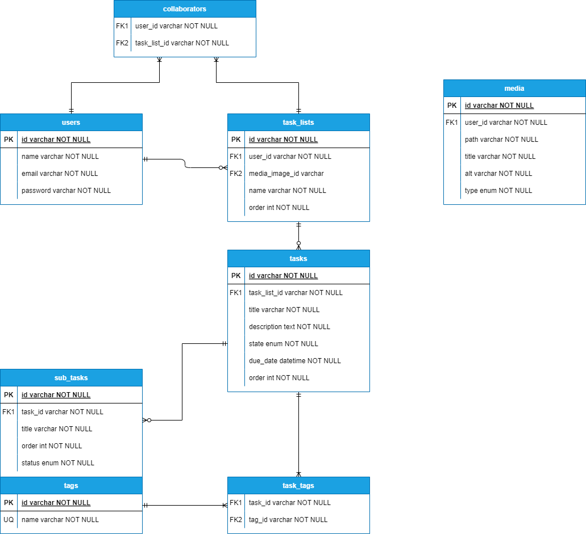

# ToDo App

## Proyectos

- [Frontend Angular SSR v18](https://github.com/rubenfgr/todo-app-front-angular-ssr)
- [Backend NestJS v10](https://github.com/rubenfgr/todo-app-back-nest)

## Descripción

Aplicación para la gestión de tareas y listas de tareas. Permite a los usuarios crear, leer, actualizar y eliminar tareas y listas de tareas. Además, permite añadir subtareas, comentarios, etiquetas y archivos multimedia a las tareas.

## Diagrama relacional

Estados de las tareas:
- `0`: Pendiente
- `1`: En progreso
- `2`: Completada
- `3`: Cancelada

## Funcionalidades

### Autenticación y Autorización:

- Registro y login de usuarios.
- Gestión de sesiones y permisos para acceder a listas y tareas.

### Gestión de Listas y Tareas:

- Crear, leer, actualizar y eliminar listas y tareas.
- Filtrar y ordenar tareas por fecha de vencimiento, prioridad y estado.

### Gestión de Subtareas

- Crear, leer, actualizar y eliminar subtareas de una tarea específica.

### Gestión de Media

- Crear, leer, actualizar y eliminar archivos multimedia.
- Añadir y gestionar imágenes a listas de tareas.

### Etiquetas

- Añadir y gestionar etiquetas para las tareas.
- Filtrar tareas por etiquetas.

### Comentarios

- Añadir y gestionar comentarios en tareas específicas.

### Colaboración

- Invitar a otros usuarios a colaborar en listas de tareas.
- Gestionar permisos de colaboradores (editar, ver, etc.).